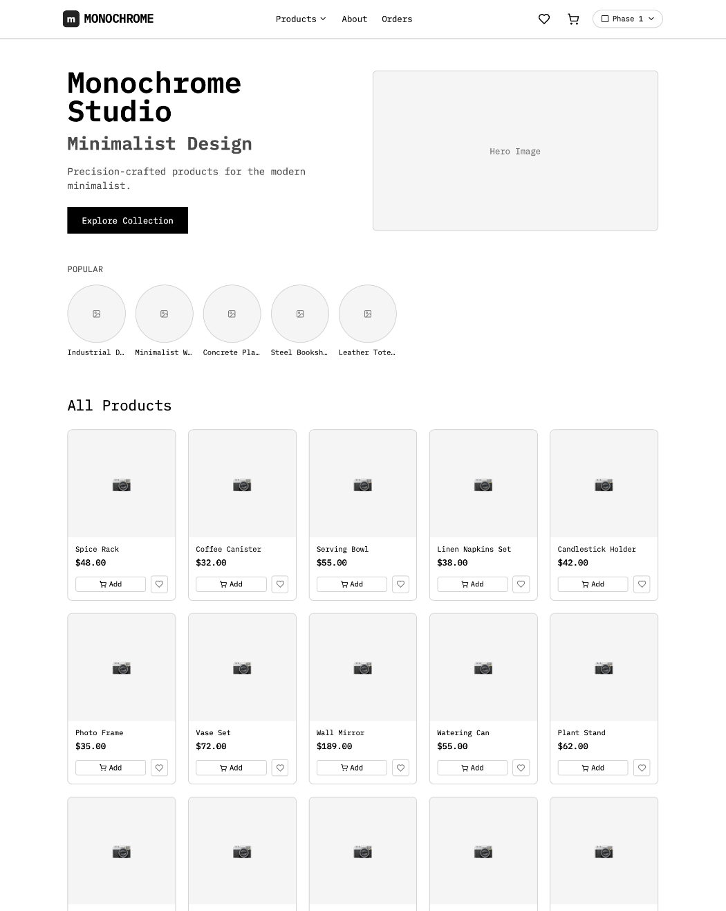

cat > README.md << 'EOF'
# Monochrome Studio – Swiss Industrial E-Commerce

A minimalist e-commerce platform built with a 3-phase evolution approach: Grayscale Foundation → Color + UI Polish → Animation + Delight.

---

## About This Project

This e-commerce project is built step by step using a 3-phase approach. Instead of building everything at once, this method shows how a website can grow from a basic design to a fully polished experience.

Each phase builds on the previous one, demonstrating how design and functionality evolve over time.

---

## The 3-Phase Plan

| Phase | Name | Description |
|-------|------|-------------|
| Phase 1 | Grayscale Foundation | Black, white, and shades of gray. Focuses on structure and usability. |
| Phase 2 | Color + UI Polish | Adding brand colors (navy blue, gold, and red). Refining the user interface. |
| Phase 3 | Animation + Delight | Adding smooth transitions and micro-interactions for a polished feel. |

---

### Phase 1: Grayscale Foundation (Complete)

This phase focuses on structure and usability without the distraction of color.

**What was built:**
- A fully functional e-commerce store using only black, white, and gray colors
- Product catalog with 49 items across multiple categories
- Shopping cart and wishlist functionality
- Mock Stripe checkout system
- Order history page

**Why this matters:**
Starting with grayscale forces focus on structure, spacing, and usability instead of colors. This proves that good design works even without color.

---

### Phase 2: Color + UI Polish (In Progress)

This phase adds brand identity and visual refinement to the store.

**What is being added:**
- Brand colors: Navy Blue (primary), Gold (secondary), Red (accent)
- Better visual hierarchy with more contrast
- Improved shadows and borders
- Refined spacing and larger touch targets

**Why this matters:**
This phase adds personality and brand identity. The colors are inspired by Swiss industrial design: clean, precise, and timeless.

---

### Phase 3: Animation + Delight (Coming Next)

This phase brings the store to life with purposeful motion and interactions.

**What is planned:**
- Smooth page transitions
- Micro-interactions (bouncing buttons, pop effects)
- Shimmer loading states
- Hover effects (products lift on mouseover)

**Why this matters:**
Animation makes the website feel alive and responsive. It creates smooth, natural user experiences without being flashy.

---

## How the Theme System Works

The theme system uses a "Phase Switcher" dropdown in the header. You can toggle between all three phases with one click.

Each phase is powered by CSS variables. Colors, fonts, and spacing are all controlled in one place, making it easy to add new themes or switch between them.

---

## Tech Stack

| Category | Tools |
|----------|-------|
| Frontend | Next.js 15, React, TypeScript, Tailwind CSS |
| Database | PostgreSQL (Supabase), Prisma ORM |
| State Management | Zustand (cart and wishlist) |
| Payments | Mock Stripe Checkout |
| Email | Nodemailer (Gmail SMTP) |
| Deployment | Vercel |
| Version Control | Git and GitHub |

---

## Features

- Product Catalog: 49 products with categories and detail pages
- Shopping Cart: Add, remove, and update quantities
- Wishlist: Save favorite products
- Checkout: Mock Stripe payment flow
- Order History: View past orders
- Contact Form: Email functionality with Nodemailer
- Responsive Design: Works on desktop, tablet, and phone
- Theme Switcher: Toggle between grayscale, color, and animated themes

---

## Screenshots

| Phase 1: Grayscale | 

| Phase 2: Color |

| Phase 3: Animated |

---

## Project Structure
